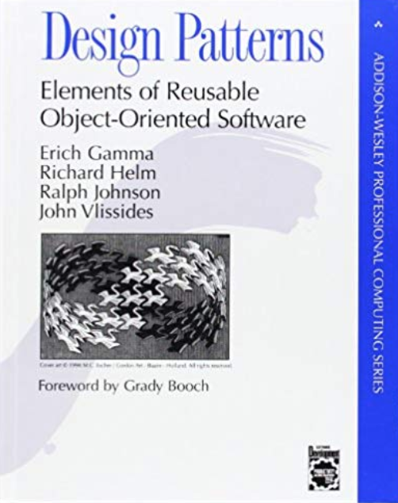
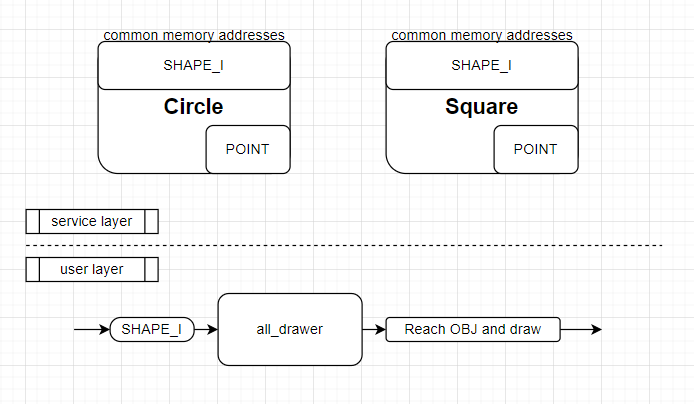
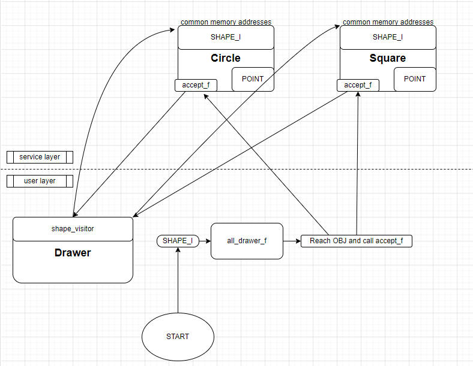
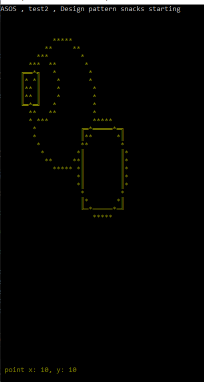

# Gang of Four (GOF) Design Patterns Test Applications

This repository is created to implement and test Gang of Four (GOF) Design Patterns learned by reading the book "Design Patterns: Elements of Reusable Object-Oriented Software". These design patterns are general solutions to common problems encountered in software development.

## Technologies Used

- Language: C++ 20
- Development Environment: [Visual Studio]
- Libraries Used: [STD]

## Applications

- **Classic OOP**
  - Description: Root logic example for object orianted programing.
  - File: clasic_oop
 
   
   simple design logic for example
 
- **Visitor Pattern**
  - Description: A C++ application implementing and testing the Visitor design pattern. The Visitor pattern allows adding new operations to existing object structures without modifying those structures. It is useful when a set of operations is defined on an object structure, but it is necessary to perform these operations in various ways and on different classes of objects.
  - File: variant_visitor_pattern / cyclic_visitor_pattern (acyclic active too) or variant_visitor_pattern

 
cyclic_visitor_pattern conceptual design
 
 
 console out

- **Singleton Pattern**
  - Description: A C++ application implementing and testing the Singleton design pattern.
  - File: [TODO]

- **Factory Pattern**
  - Description: A C++ application implementing and testing the Factory design pattern.
  - File: [TODO]

- **Observer Pattern**
  - Description: A C++ application implementing and testing the Observer design pattern.
  - File: [TODO]

... [More Applications Will Be Added]

## Contact

For questions, suggestions, or feedback, you can email me
 
Ali Şahbaz - 
ali_sahbaz@outlook.com
