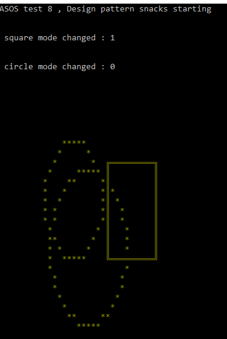

# Gang of Four (GOF) Design Patterns Test Applications

This repository is created to implement and test Gang of Four (GOF) Design Patterns learned by reading the book "Design Patterns: Elements of Reusable Object-Oriented Software". These design patterns are general solutions to common problems encountered in software development.

## Technologies Used

- Language: C++ 20
- Development Environment: [Visual Studio]
- Libraries Used: [STD]

## Applications

- **Classic OOP**
  - Description: Root logic example for object orianted programing.
  - File: clasic_oop
 
   
   simple design logic for example
 
 **Visitor Pattern**
  - Description: A C++ application implementing and testing the Visitor design pattern. The Visitor pattern allows adding new operations to existing object structures without modifying those structures. It is useful when a set of operations is defined on an object structure, but it is necessary to perform these operations in various ways and on different classes of objects.
  - File: variant_visitor_pattern / cyclic_visitor_pattern (acyclic active too) or variant_visitor_pattern

 
cyclic_visitor_pattern conceptual design
  
 
 console out

 **Command Pattern**
  - Description: The Command Pattern is a behavioral design pattern that encapsulates a request as an object, thereby allowing for parameterization of clients with queues, requests, and operations. It allows the parameterization of clients with queues, requests, and operations. In this pattern, requests are wrapped under an object as command and passed to invoker object. Invoker object looks for the appropriate object which can handle this command and passes the command to the corresponding object which executes the command.
  - File: command_pattern

command_pattern conceptual design
  
 
 console out

 **Extensive Hierarchy**
  - Description: Extensive Hierarchy is a design pattern in C++ that involves creating a large number of derived classes that inherit from a common base class. This pattern is commonly used in object-oriented programming to organize classes into a hierarchical structure, where each derived class adds new functionality or behavior while inheriting the properties and methods of the base class.
  - File: extensive_hierarchy

 
extensive_hierarchy conceptual design
  
 
 console out

**Observer Pattern**
  - Description: The Observer Pattern is a behavioral design pattern that defines a one-to-many dependency between objects so that when one object changes state, all its dependents are notified and updated automatically. It is commonly used to implement distributed event handling systems, such as in graphical user interfaces (GUIs), where an object (subject) maintains a list of its dependents (observers) and notifies them of any state changes.
  - File: observer_pattern

 
observer_pattern conceptual design
  
 
 console out

 **Strategy Pattern**
  - Description: The Strategy Pattern is a behavioral design pattern that enables an algorithm's behavior to be selected at runtime. It defines a family of algorithms, encapsulates each algorithm, and makes them interchangeable. This pattern allows the algorithm to vary independently from the clients that use it, enabling easy modification, testing, and reuse of algorithms.
  - File: strategy_pattern or strategy_pattern_with_std_function

 
strategy_pattern conceptual design

 
strategy_pattern_with_std_function conceptual design
  
 
 console out
 
 **Singleton Pattern**
  - Description: A C++ application implementing and testing the Singleton design pattern.
  - File: [TODO]

 **Factory Pattern**
  - Description: A C++ application implementing and testing the Factory design pattern.
  - File: [TODO]

**CRTP**   [TODO]
**Bridge Pattern**   [TODO]
**Decorator**   [TODO]
 
... [More Applications Will Be Added]

## Contact

For questions, suggestions, or feedback, you can email me
 
Ali Şahbaz - 
ali_sahbaz@outlook.com
